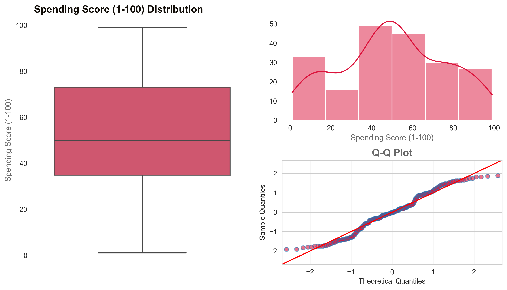
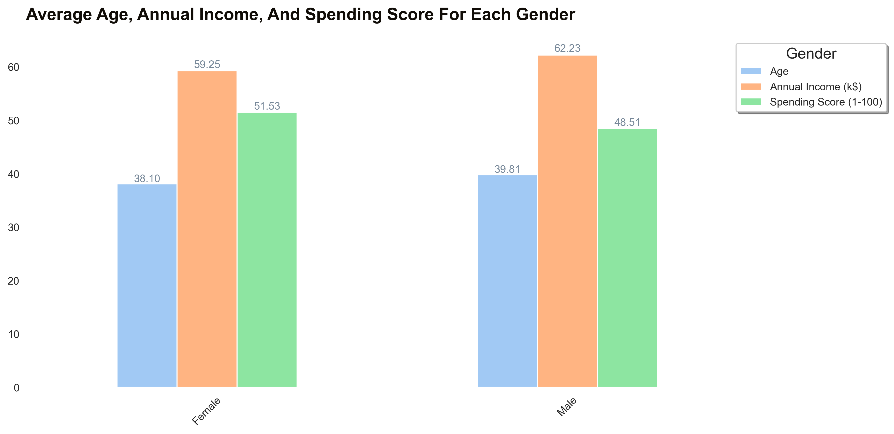
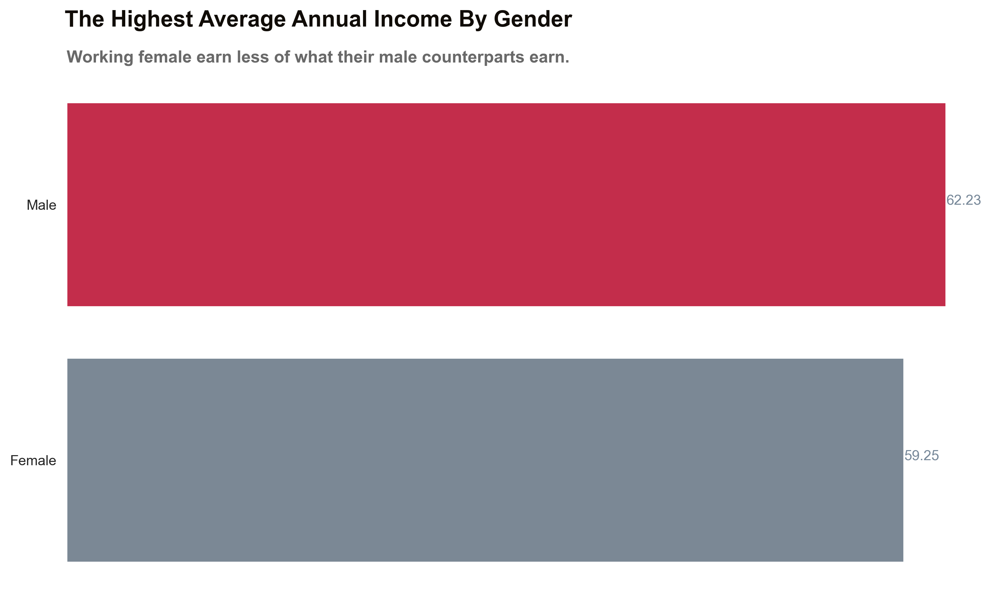
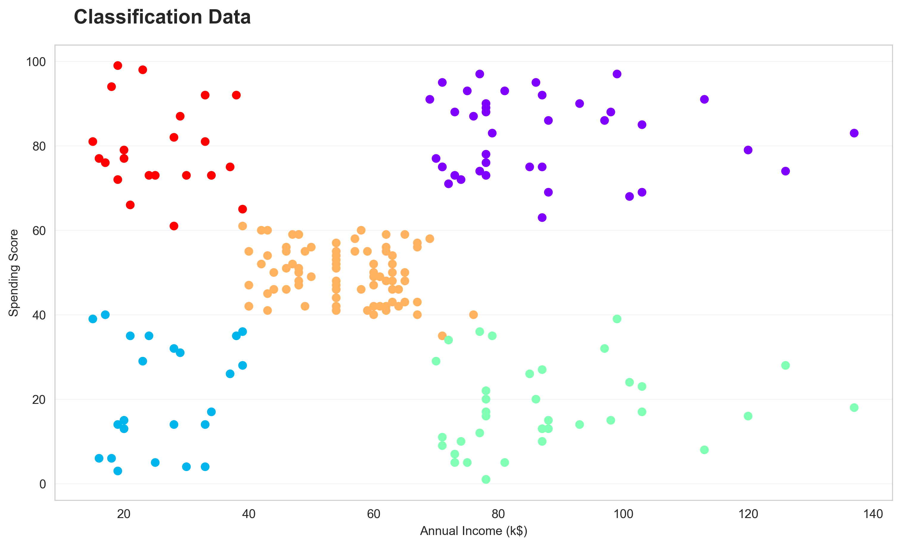

# Mall Customers DataSet 

* Number Of Customers **_200_**
* The Average Annual Income Per Customer **_60.56_**
* The Median Age Of Customers **_36_**
* The Standard Deviations For Age **_13.97_** And The Std For Annual Income **_26.26_**

# (2) Analysis
## Distribution

    Annual Income (K$) Skewness & Kurtosis  
    * Skewness:  0.322
    * Kurtosis: -0.098

    Age Skewness & Kurtosis
    * Skewness:  0.486
    * Kurtosis: -0.672

    Spending Score Skewness & Kurtosis 
    Skewness: -0.047
    Kurtosis: -0.827

    Gender Total
    * Female 112
    * Male 88

# Compare distributions

# Boxplot

# (3) Bi-variate Analysis
## 3.1) Scatter plot

## 3.2) Pair plot

## 3.3) Groupby
Utilize the group by function to calculate the average age, annual income, and spending score for each gender

             Age        Annual Income (k$)       Spending Score (1-100)
    Gender                                                   
    Female   38.10               59.25                   51.53
    Male     39.81               62.23                   48.51

## Heat Map

# 4.1) Pivot

                 Annual Income (k$)       CustomerID            Spending Score (1-100)      
    Gender             Female  Male     Female       Male                 Female  Male
    Age                                                                               
    66                   63.0  63.0      107.0      110.0                   50.0  48.0
    67                   47.0  45.0       63.0  65.666667                   52.0  38.0
    68                   53.5  63.0       79.5      109.0                   51.5  43.0
    69                No Data  44.0    No Data       58.0                No Data  46.0
    70                No Data  47.5    No Data       66.0                No Data  55.5

# 4.2) Where function
    mall_customers_df["age_group"] = np.where(mall_customers_df["Age"] < 30, "18-29",
                                          np.where(mall_customers_df["Age"] < 45, "30-40",
                                          np.where(mall_customers_df["Age"] < 55, "45-54", "55+")))

    grouped_df = mall_customers_df.groupby(["age_group", "Gender"])\
    .agg({"Annual Income (k$)": ["count", "mean"]}).round(2)

                                       Annual Income (k$) 

                                        count   mean

        age_group Gender   

        18-29     Female                 29     50.66
                  Male                   26     54.65
        
        30-44     Female                 46     66.17
                  Male                   30     75.90

        45-54     Female                 25     58.88
                  Male                   14     58.21

        55+       Female                 12     54.25
                  Male                   18     53.50

# 4.3) Classification

The Spen_class column will class the data to five groups as follows:

    X = mall_customers_df.iloc[:, [3, 4]].values
    kmeans = KMeans(n_clusters=5, init='k-means++', max_iter=300, n_init=10, random_state=0)
    y_kmeans = kmeans.fit_predict(X)
    mall_customers_df["Spen_Class"] = y_kmeans
   
    title = "Relation between spending score, annual income as spen class"
    subtitle = "classification data"
   
    eda.visualize_advanced_scatter_plot(mall_customers_df, 'Annual Income (k$)', 'Spending Score (1-100)', "Spen_Class",
                                        title, subtitle)
        

        

###  DataSet with High Income & High Spending Score 

                      CustomerID  Gender  Age  Annual Income (k$)  Spending Score (1-100) Spen_Class
                123         124    Male   39                  69                      91          4
                125         126  Female   31                  70                      77          4
                127         128    Male   40                  71                      95          4
                129         130    Male   38                  71                      75          4
                131         132    Male   39                  71                      75          4 

