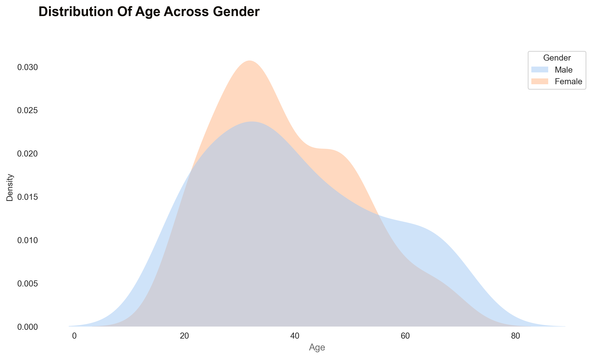
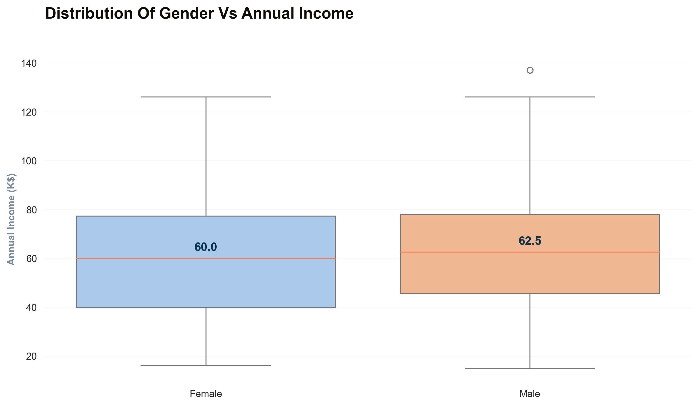
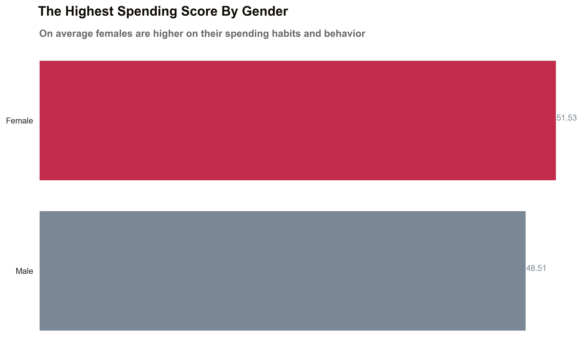

# Mall Customers DataSet 

* Number Of Customers **_200_**
* The Average Annual Income Per Customer **_60.56_**
* The Median Age Of Customers **_36_**
* The Standard Deviations For Age **_13.97_** And The Std For Annual Income **_26.26_**

# (2) Analysis
## Distribution

    Annual Income (K$) Skewness & Kurtosis  
    * Skewness:  0.322
    * Kurtosis: -0.098

    Age Skewness & Kurtosis
    * Skewness:  0.486
    * Kurtosis: -0.672

    Spending Score Skewness & Kurtosis 
    Skewness: -0.047
    Kurtosis: -0.827

    Gender Total
    * Female 112
    * Male 88

# Compare distributions

# Boxplot

# (3) Bi-variate Analysis
## 3.1) Scatter plot

## 3.2) Pair plot

## 3.3) Groupby
Utilize the group by function to calculate the average age, annual income, and spending score for each gender

             Age        Annual Income (k$)       Spending Score (1-100)
    Gender                                                   
    Female   38.10               59.25                   51.53
    Male     39.81               62.23                   48.51

## Heat Map

# 4.1) Pivot

                 Annual Income (k$)       CustomerID            Spending Score (1-100)      
    Gender             Female  Male     Female       Male                 Female  Male
    Age                                                                               
    66                   63.0  63.0      107.0      110.0                   50.0  48.0
    67                   47.0  45.0       63.0  65.666667                   52.0  38.0
    68                   53.5  63.0       79.5      109.0                   51.5  43.0
    69                No Data  44.0    No Data       58.0                No Data  46.0
    70                No Data  47.5    No Data       66.0                No Data  55.5

# 4.2) Where function
    mall_customers_df["group_age"] = np.where(mall_customers_df["Age"] <= 35, "18-35",
                                          np.where(mall_customers_df["Age"] <= 47, "36-47",
                                          np.where(mall_customers_df["Age"] <= 58, "48-58", "59-70")))

    grouped_df = mall_customers_df.groupby(["group_age", "Gender"]).agg({"CustomerID": ["count"],
                                                                     "Annual Income (k$)": ["mean"]})

                       CustomerID      Annual Income (k$)
                           count               mean
    group_age  Gender                              
   
    18-35      Female         57            55.947368
               Male           41            64.292683
    36-47      Female         27            71.037037
               Male           18            70.777778
    48-58      Female         20            55.450000
               Male           13            57.307692
    59-70      Female          8            52.500000
               Male           16            51.312500

# 4.3) Classification

The Spen_class column will class the data to five groups as follows:

    0 - Low Income 15 - 40  and Low spending score 1 - 40 
    1 - Low Income 15 - 40 and High spending score 60 -99
    2 - Middle Income 40 - 70 and middle spending score 40 -60 
    3 - High Income 70 - 99 and Low spending score 1 -40 
    4 - High Income 70 -99 and High spending score 60 -99 

    

        CustomerID  Gender   Age     Annual Income (k$)  Spending Score (1-100)     Spen_Class
    0           1    Male     19           15                      39                   0
    1           2    Male     21           15                      81                   3
    2           3    Female   20           16                       6                   0
    3           4    Female   23           16                      77                   3
    4           5    Female   31           17                      40                   0

###  DataSet with High Income & High Spending Score 

            CustomerID  Gender   Age       Annual Income (k$)      Spending Score (1-100)   Spen_Class
        123         124    Male   39                  69                      91                4
        125         126  Female   31                  70                      77                4
        127         128    Male   40                  71                      95                4
        129         130    Male   38                  71                      75                4
        131         132    Male   39                  71                      75                4
        133         134  Female   31                  72                      71                4
        135         136  Female   29                  73                      88                4
        137         138    Male   32                  73                      73                4
        139         140  Female   35                  74                      72                4
        141         142    Male   32                  75                      93                4